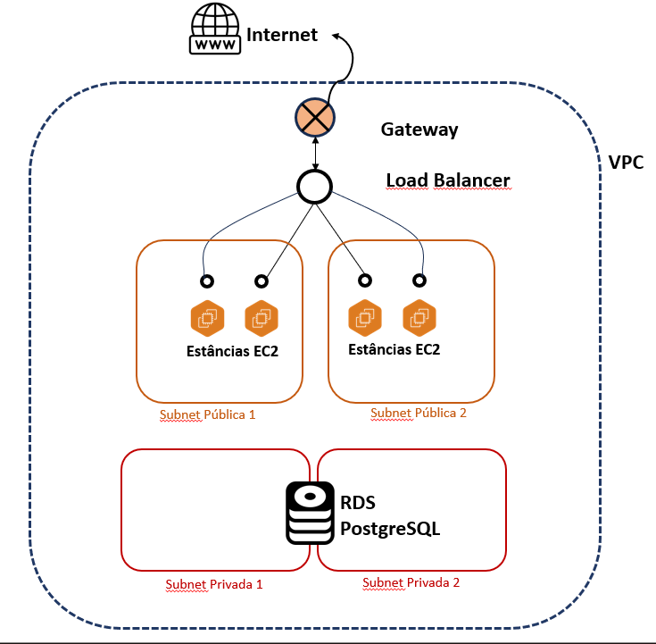

# Projeto-Cloud

### Descrição

O projeto consiste em um ambiente em nuvem criado a partir da plataforma da AWS, para uma aplicação escolhida pelo aluno. Sua construção foi feita a partir da ferramenta Terraform. Este, por sua vez, permite que desenvolvedores criem e gerenciem infraestruturas complexas de maneira segura e eficiente, a partir de uma linguagem de programação declarativa e intuitiva.

O ambiente, criado a partir do Terraform, é alocado na AWS. Esta é uma plataforma desenvolvida pela Amazon para auxiliar e fornecer serviços para a criação de aplicações e ambientes em nuvem. Dessa forma, utilizo o Terraform para então criar a estrutura, alocada na AWS. 

---

### Introdução

Antes de explicar de maneira detalhada como a infraestrutura criada para este projeto funciona de fato, devemos entender primeiramente o que são e como funcionam cada um dos elementos que a compõem. Assim, temos:

- **Instância**: funciona como uma máquina virtual, que pode ser criada, configurada, acessada, gerenciada e destruída remotamente. A vantagem vem no fato de que ter uma máquia física, como um computador, para uma aplicação grande de base de dados, por exemplo, é demasiadamente custoso para uma empresa. Requer um investimento em hardware, manutenção física, espaço, e ainda no caso de fim de necessidade, a máquina se torna um "peso-morto". Enquanto isso, instâncias podem ser criadas e destruídas de acordo com a necessidade e preferência do usuário. Ainda, são muito mais facilmente escaláveis, mais baratas, seguras e, consequentemente, mais adequadas para um contexto de nuvem.

- **EC2**: é um tipo de instância oferecida pelos recursos da AWS. Desta forma, pode ser gerenciada remotamente. A partir dela, os usuários da AWS podem executar aplicativos e programas, em cima de inúmeros possíveis sistemas operacionais. Para este caso, definimos o que chamamos de "imagem" da máquina. Em outras palavras, é um arquivo que contém um sistema operacional qualquer, e que será utilizado para que a máquina criada trabalhe em cima deste sistema escolhido.
Também, definimos quais serão os recursos de hardware utilizados pela instância, como memória, processamente, entre outros. Todas estas máquinas virtuais criadas, são disparadas em uma VPC, o que permite o acesso à internet.

- **VPC**: Virtual Private Cloud é uma rede virtual privada, criada como um ambiente para o seu projeto, dentro da AWS. Muito próxima de uma rede tradicional, operada fisicamente. Entretanto, com as vantagens já citadas anteriormente, sendo ela dimensionável e de fácil gerenciamento (ainda remoto!). A partir dela, podemos criar sub-redes, rotas, gateways e outros elementos de rede, conforme a necessidade do nosso projeto.

A partir destes 2 recursos, já é possível criar uma infraestrutura básica. Entretando, para o funcionamento completo do nosso projeto, ainda precisamos de mais alguns elementos. 

- **Gateway**: funciona como um ponto de saída e entrada para a internet. É a partir dele que nossa VPC tem acesso à internet e, consequentemente, por meio dela, nossas instâncias. Este recurso é responsável por gerenciar o tráfego da rede, endereçar os pacotes de dados para cada IP, e ainda, tratar a segurança da nossa rede. 

- **Routing Tables**: são tabelas responsáveis por definir as rotas dos pacotes de dados. Dessa forma, acabam por fazer a "ligação" entre os componentes da rede, como uma subnet e o gateway, por exemplo. Com essa associação (como chamamos estas ligações), defimos que os pacotes de dados que saem da subnet, passam pelo gateway, para poderem chegar à internet.

- **Security Group**: é uma estrutura por meio da qual definimos regras de segurança. Assim, definimos quais portas funcionarão como entrada e saída da nossa rede. Aplicamos estas regras para recursos, como instâncias, por exemplo. Assim, podemos na aplicação, restringir a nossa base de dados para que apenas as instâncias acessem ela, a partir de uma ou mais portas pré definidas. 

- **Instância DB**: será a instância utilizada para alocar a nossa base de dados. No caso, estamos utilizando uma instância PostgreSQL, com a configuração db.t2.micro. Esta especificação é um tipo pré determinado de instância, em termos de hardware. Assim como ela, existem outros tipos de pré configuração de instâncias.   

- **Auto Scaling Group**: este recurso possui um conjunto de instâncias, criadas pelo usuário. A partir dele, definimos regras de gerencimaneto de escalabilidade. Desta forma, o recurso adapta o número de instâncias de acordo com a necessidade da aplicação. Para fazer isso, ele monitora o uso, e com isso aumenta ou diminui o número de instâncias, criando ou destruindo elas. 

- **Cloud Watch**: é o recurso responsável por monitorar o desempenho das instâncias e, consequentemente, trabalhar juntamente com o grupo de autoscaling para atuar quando for necessário (criando ou destruindo instâncias). Para isso, definimos métricas, que serão como as "regras", para que uma instância seja criada ou destruída.

---

### Aplicação

A aplicação escolhida para o projeto aplica um CRUD básico, em cima de uma base de dados PostgreSQL. Uma vez aberta a aplicação, ao fim da execução, é possível visualizar, acessar, editar, deletar e criar novos dados na database.

---

### Como executar

A execução é simples. Uma vez clonado o repositório, abra seu terminal e navegue até a pasta raiz do projeto. Em seguida, execute os seguintes comandos:

> terraform init

> terraform plan

> terraform apply --auto-approve

Uma vez executados, a infraestrutura será criada. Entretanto, pode demorar por volta de 10 minutos. Passado o tempo, o terminal irá printar o link para acesso à aplicação.

Para destruir a infraestrutura, execute:

> terraform destroy --auto-approve

---

### Funcionamento do Projeto

Uma vez entendidos cada um dos recursos, podemos então partir para a explicação da estrutura como um todo.

A VPC funciona como o ambiente para o nosso projeto, e possui CIDR 10.0.0.0/16. A partir dela, criamos subnets (sub-redes, públicas ou privadas), dentro da nossa rede principal. Desta forma, podemos separar e isolar os recursos da infraestrutura do projeto, de acordo com a necessidade. Para este projeto, foram criadas 2 subnets publicas e 2 outras privadas. Para cada tipo, há uma localizada na região us-east-1a e outra na us-east-1b. As públicas possuem CIDR '10.0.1.0/24' e '10.0.2.0/24'. Já as privadas, '10.0.101.0/24' e '10.0.102.0/24'.

O fato de ser pública significa que dá acesso à internet aos dispositivos (no caso, instâncias) dentro dela. Por conta disto, esta subrede precisar endereçar IP's públicos para cada uma das máquias presentes. Já no caso das redes privadas, estes IP's não são endereçados. 

Entretanto, esta conexão não se dá assim diretamente. Para isso, criamos um gateway, que é o responsável por conectar nossa subrede à internet de fato. Para estabelecer esta associação, criamos uma routing table. Por esta, associo a sub-rede ao gateway, fazendo com que esta tenha acesso à internet. 

Para este projeto, foi criado um load balencer que distribuirá o tráfego de dados entre as instâncias criadas. Estas, por sua vez, são criadas a partir do grupo de auto scaling. Pela configuração escolhida, são criadas 4 instâncias, sendo o número mínimo de 2, e máximo de 8. Assim, o recurso irá destruir ou criar instâncias dependendo da necessidade. Entretanto, para auxiliar nesta detecção de quando aumentar ou diminuir o número de EC2's, temos o CloudWatch. Com ele, criamos 2 métricas, sendo uma de entrada (**in**, de criação) e outra de saída (**out**, de exclusão). Tais métricas funcionam de forma que caso 70% ou mais da capacidade de processamento das instâncias estiver sendo utilizado por um intervalo de dois minutos, é criada uma nova. Ao mesmo tempo, caso 20% ou menos desta capacidade esteja sendo utilizada por um mesmo intervalo de tempo, uma instância é destruída.

Estas instâncias trabalharão para a aplicação. Irão receber os requests distribuídos pelo load balencer e acessar então a base de dados.  

Já a base de dados, foi alocada em uma instância RDS, do tipo PostgreSQL. Esta, está em uma rede privada, não tendo acesso à internet. Esta escolha foi feita justamente por segurança. Assim, definimos, por meio de grupos de segurança e regras de acesso, que apenas as instâncias podem acessar a base de dados.

Um diagrama da aplicação pode ser visualizado abaixo:

---

### Análise de custos

A estimativa de preços foi calculada a partir do recurso Aws Pricing Calculator. O link para o relatório completo está disponível clicando [aqui](https://calculator.aws/#/estimate?id=b4f2bc627491fc7d6770082275cbaccee20f10c4).

O resultado obtido foi um custo de **92,63 USD ao mês**, totalizando 1.111,56 USD ao ano, incluindo um custo inicial. 

Para chegar neste resultado, foram inclusos nos cálculos o seguintes recursos:

- Amazon RDS for PostgreSQL
    - Com 20Gb de armazenamento, em cima de uma instância t2.micro. Usa 100% ao mês, dado que estaria disponível 24h por dia. Ainda, possui implantação Multi-AZ e armazenamento de backup adicional de 10Gb. Todos estes dados foram os utilizados no código, sendo assim os corretos como métricas.
    - **53,73 USD ao mês**

- Elastic Load Balancing
    - Considerada uma aplicação Load Balancer com um volume de 0,5Gb processados por instâncias por hora. O número baixo se justifica pelo baixo uso, ou seja, baixas requisições. Ainda, na mesma linha de raciocínio, foi setada uma média de solicitações por segundo de 0.01
    - **19,35 USD ao mês**

- Amazon Virtual Private Cloud (VPC)
    - Nossa VPC, como ambiente do projeto.
    - **00,00 USD ao mês**

- Amazon EC2
    - Nossas quatro instâncias (número setado como desejado), que rodam como grupos de auto scaling. Configuradas como tipo t2.micro, dado que não é necessário, pelo volume de requests e do projeto como um todo, um tipo mais poderoso.
    - **18,90 USD ao mês** (preço pelas 4 instâncias)

- Amazon CloudWatch
    - Registrado com duas métricas (nossas métricas de scale_in e scale_out).
    - **00,0 USD ao mês**

Caso o hyperlink apresente mal funcionamento, aqui está o link cru:
https://calculator.aws/#/estimate?id=b4f2bc627491fc7d6770082275cbaccee20f10c4 

---

### Possível otimização

- **Número de Instâncias**: uma possível otimização seria a redução de custos. Para isso, é possível diminuir o número de instâncias criadas. Porém, para tomar esta medida, é necessária cautela e análise, dado que isto afetaria o desempenho da aplicação.

